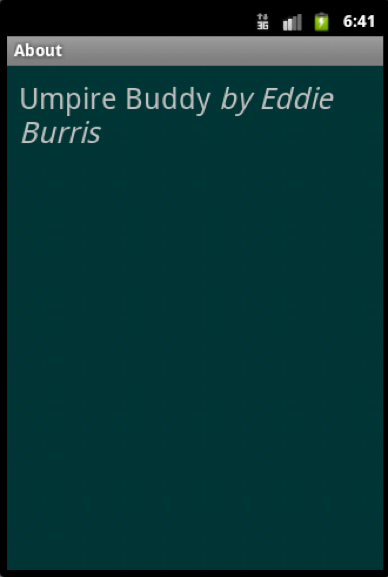

# UmpireBuddy

## Version 2.0 (Lab #2)

### Introduction
The purpose of labs 1 and 2 is to give you practice with Android features you are likely to use this semester as you implement your project idea. Lab 1 gave you practice with Activities, UI components, event handlers and dialog boxes. Lab 2 adds:

 * Application icons 
 * Menus (action/tool bar and contextual menus)
 * Starting a new Activity
 * Persistent storage (saving state between sessions)
 * Screen Rotations (switching back and forth between portrait and landscape)[1](#f1)
 * Preferences (PreferenceActivity)

### Part 1 – Application Icon
Create a custom application launch icon for your application. For example:



Hints:

1.	Create an image using an image editing program such as Gimp. Make it square. Save it as a .png with a transparent background. Make sure file name is all lower case characters with no special symbols. [Save at different sizes if you want it to look good on a range of devices.]
2.	Use Image Asset Studio to create images at different resolutions. (ref: http://developer.android.com/tools/help/image-asset-studio.html) (Manual way: Copy images at different resolutions to mipmap res subfolder"s. [May have to switch to Project View. If you have only one image, copy to any one of the subfolders.]
3.	Reference the image in the manifest file under application/icon.

For more information about drawable images in Android, see: http://developer.android.com/design/style/iconography.html

The app name on the home screen and the label on the main activity are specified in the AndroidManifest.xml file:



The default name for both of these is the name of your app. You might want to change these to something more descriptive.

### Part 2 - Menus
Add a menu to the main activity of the application. Include two options, one for resetting the count ("Reset") and another for displaying information about the application ("About"). Place the reset menu option icon on the action bar with text "Reset" if there is room. Make sure the About menu option always stays in the overflow area. For example:

 and 

Note, you may have to rotate the screen to create enough room on the action/tool bar for the text "Reset" to display. On my emulator, I rotated the screen by turning off number lock and pressing the 9 key on the keypad.

Selecting the Reset menu option should reset the count. Selecting the About menu option should display a new activity with information about the application. Be sure to include your name in the new activity. For example:


I recommend using Android Studio's Image Asset program to create the image icon. You can create the icon from clipart:

An alternative to creating your own drawable is to copy existing system drawables from the SDK. You can find these files at: `C:\Users\<user name>\AppData\Local\Android\sdk\platforms\android-23\data\res\drawable-hdpi`

Another option is to reference one of the system icon images. Example: `icon="@android:drawable/ic_menu_add"`. However, these aren't consistent across devices.

**[Extra Credit]** Provide a contextual menu using the contextual action mode on the background  of the main activity (or any UI component of your choosing) such that when the user long clicks a menu pops up that offers the ball and strike options. Here is an example with Count Much More:


References:

http://developer.android.com/guide/topics/ui/menus.html  
http://developer.android.com/guide/topics/resources/menu-resource.html  
http://developer.android.com/training/basics/firstapp/starting-activity.html

### Part 3 – Persistent Storage
Add a field which counts total outs. The value should persist between sessions (even when user exits the app by pressing the back key). The only way to reset the value is by clearing the data for the app through settings.



### Part 4 – Rotations [Extra Credit]
Define a layout to be used in landscape mode that positions the buttons side-by-side when device is in landscape mode. The strike and ball count should remain unchanged when flipping between portrait and landscape.



### Part 5 – Preferences [Extra credit]
Add a menu option for application settings. Selecting settings should bring up a settings activity (I suggest using new style Preference Fragments ) that allows the user to select whether or not to announce "out" and "walk" audibly using Android's support for text-to-speech (tts). Preferences should of course persist between sessions. The setting should work. Great the user with an audible "Out" or "Walk" when appropriate.
## Version 1.0 (Lab #1)
The purpose of this lab assignment is to help you get started with Android programming. It will introduce you to the syntax and semantics of Android/Java along with the mechanics of using Android Studio with the Android plugin.

The lab assignment is to create an Android application that can function as a ball-strike counter an umpire might use during a baseball game to keep track of the count for a batter.

For now, the application only needs to keep track of balls and strikes for a single batter. In a future assignment, I may have you extend it to keep track of outs and/or innings. (If you want to add extra features during assignment #1, have at it.)

If the count reaches 3 strikes first, your application should display a dialog box announcing the batter is "Out!" If the count reaches 4 balls first, your application should display a dialog box announcing "Walk!" After either one, the count should be reset for the next batter.

The final result should look something like:

 

### Questions
1. What, if anything, is created for you when you enter the following as a value in an .xml layout? `android:id="@+id/strike_button"`
  > The plus sign "+" indicates that a new resource reference should be created and added to the R.java file.

2. What about when you enter: `android:text="@string/strike_button_label"`
  > This is a reference to a resource that is located in the string namespace.

---
<b id="f1">1</b> To rotate the emulator, turn off number lock then press <kbd>9</kbd> on the number pad (alternatively, use <kbd>control</kbd>+<kbd>F12</kbd>).  [↩](#a1)
